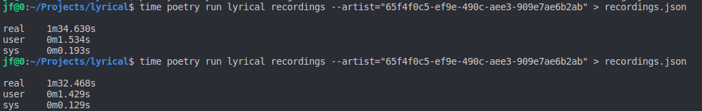
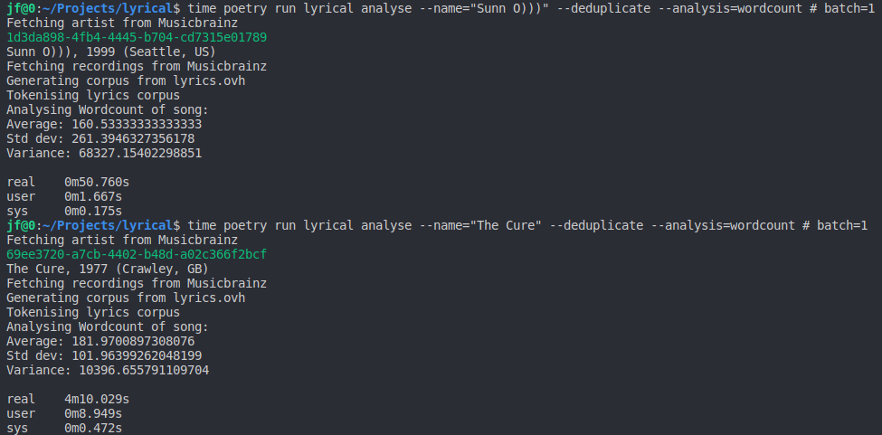
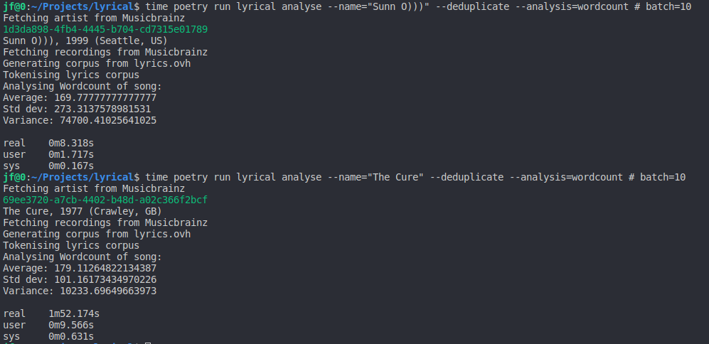

[](https://github.com/openfinch/lyrical/actions?workflow=Tests)
# Lyrical
## A lyrics corpus analysis tool

## Table of Contents
+ [About](#about)
+ [Getting Started](#getting_started)
+ [Usage](#usage)
+ [Concurrency](#concurrency)
+ [Improvements](#improvements)

## About <a name = "about"></a>
Lyrical is a simple CLI tool for analysing lyrics corpuses, currently it can return wordcount data for a single artist.

## Getting Started <a name = "getting_started"></a>
These instructions will get you a copy of the project up and running on your local machine.

### Prerequisites

Install Poetry:

```shell
curl -sSL https://raw.githubusercontent.com/python-poetry/poetry/master/get-poetry.py | python
```

Open a new login shell or source ~/.poetry/env in your current shell:

```shell
source ~/.poetry/env
```

## Usage <a name = "usage"></a>

Each command is documented within the application:

**Root**

```
$ poetry run lyrical
Usage: lyrical [OPTIONS] COMMAND [ARGS]...

  Lyrical, the lyric analysis python tool.

Options:
  --version  Show the version and exit.
  --help     Show this message and exit.

Commands:
  analyse  Analyse a lyrics corpus for a given artist.
  search   Search the Musicbrainz database by artist.
```

**Search**

```
$ poetry run lyrical search --help
Usage: lyrical search [OPTIONS]

  Search for an artist.

Options:
  --name TEXT    The artist to search for
  --tracklist    Should Lyrical fetch a tracklist for this artist?
  --deduplicate  Should Lyrical deduplicate the tracklist?
  --help         Show this message and exit.
```

**Analyse**
```
$ poetry run lyrical analyse --help
Usage: lyrical analyse [OPTIONS]

  Search for an artist.

Options:
  --name TEXT      The artist to search for
  --analysis TEXT  Which analysis should Lyrical run? {all, wordcount}
  --deduplicate    Should Lyrical deduplicate the tracklist?
  --help           Show this message and exit.
```

### Example

```
$ poetry run lyrical analyse --name="Sunn O)))"
Fetching artist from Musicbrainz
1d3da898-4fb4-4445-b704-cd7315e01789
Sunn O))), 1999 (Seattle, US)
Fetching recordings from Musicbrainz
Generating corpus from lyrics.ovh
Tokenising lyrics corpus
Analysing Wordcount of song:
Average: 135.59574468085106
Std dev: 260.4889766151734
Variance: 67854.50693802035
```

## Notes on Concurrency <a name = "concurrency"></a>

### Musicbrainz

Initially I had intended to run the request-loop for recordings as a multi-worker concurrent process using the request_futures library, however I found during testing that the browse API for Musicbrainz is sufficiently performant, and their rate-limiting sufficiently strict, that it saved very little time (approx. 2 seconds). The screenshot below illustrates this problem (the first run is a single worker, the second run is with five; both on a large search):



I have opted to keep the futures-based code, and it's associated retry logic, in-place should we move to a higher rate limit. I am unable to find an effective way to speed this process up without breaking the Musicbrainz terms of use.

Note: The command used to test this no longer exists and has been merged into Search, it only exists for development.

### Lyrics.ovh

We can see, that by adding the same concurrency logic to the Lyrics.ovh API request, we see a significant improvement:

**Batch size 1**




**Batch size 10**



This test was run with both a small corpus (`Sunn O)))`) and a larger corpus (`The Cure`). Batch size refers to the number of parallel workers processing requests concurrently.

## Ideas for Improvements <a name = "improvements"></a>
 - **MED** Move all presentation logic into a single module
 - **MED** Add an import/export function for corpuses
 - **MED** Expose request batch size as a configurable parameter
 - **MED** Add a debug flag and logging output for troubleshooting
 - **MED** Move wordcount test to use `unittest.mock` rather than stdout redirection
 - **LOW** Add type annotations to tests/ and noxfile.py
 - **LOW** Add docstrings to test suite.
 - **LOW** Move to a string-table system for a11y.
